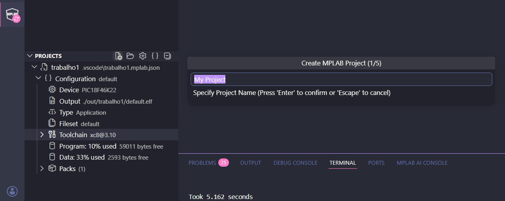
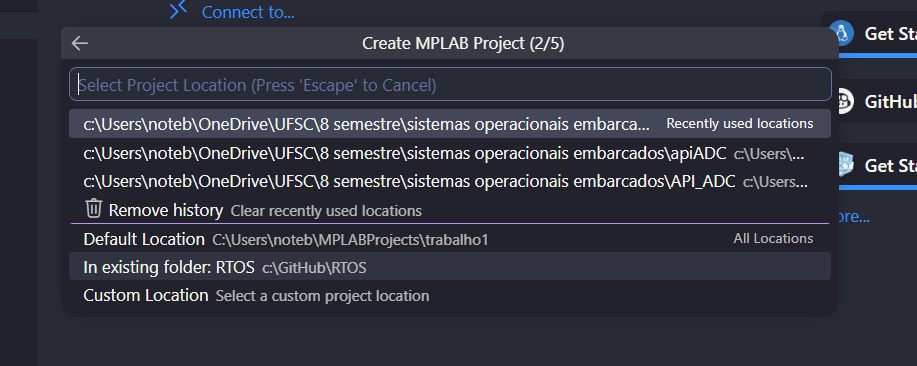
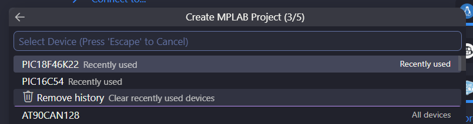
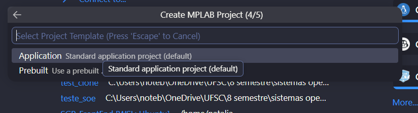
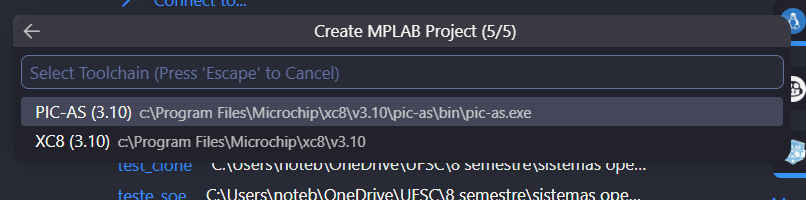

# Passos para criar um projeto
Clona o repo em uma pasta abre no vs code e siga os passos.

## 1 Criar nome do projeto
Abrir a extensão do mplab no meno lateral esquerdo, clicar em new project(primeiro simbolo ao lado de PROJECTS) e criar um nome.

## 2 Selecionar pasta 

Seleciona: "in existing folder"

## 3 Selecionar PIC 

Seleciona o pic "PIC18F4..."

## Selecionar config de template
"Aplication"

## Selecionar compilador

"xc8"
